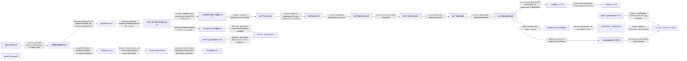

# 事件风暴业务叙事与缺口

> 派生设计提议，不是运行结果。修改来源便签，不手改此文件。

```mermaid
flowchart LR
  n_28476554d2cf5009["充值申请已记录"]
  n_c3e07eb06e45f531["本地外部付款指令预留已记录"]
  n_bd6b7a1104e5dfc4["本地外部付款指令提交已记录"]
  n_8caaa6c55f37f12d["账户入账已记录"]
  n_bc02f38b78896b7d["申购申请已记录"]
  n_86f8de7db74bce88["申购资金预留已记录"]
  n_8bd8536424c6a196["申购订单预留已记录"]
  n_a2d0aaaa4dfdd595["账户扣款已记录"]
  n_f0c986c86c59f91f["订单付款结算已记录"]
  n_9241d6a1d235de80["TA份额确认已记录"]
  n_e6881b37cbfac173["定投计划已记录"]
  n_7cfe17f45e6e7bcc["本期定投触发已记录"]
  n_b6c66a403fb2b519["本期成功已记录"]
  n_3f3be910202c3649["本期失败已记录"]
  n_4e1877850fe969ff["定投暂停已记录"]
  n_53cc6c848bf7d3ac["资金Saga结果未知已记录"]
  n_7488b23e00993d0a["资金Saga需要恢复已记录"]
  n_5361cc48fd0696ca["TA拒绝后的业务处理缺口"]
  n_22195e254d89d1ab["TA结果未知待查询核实"]
  n_23ff8737dde91f0b["付款后拒绝，退款路径待设计"]
  n_746c25ce5238241d["外部银行结果未知待核对"]
  n_cf1ca4c4fb85c20b["event-flow.wealth"]
  n_4a3433c2bd2800f9["decision.external-bank"]
  n_b90903c436dc085d["decision.settlement-refund"]
  n_6a6d82ececafd66a["decision.sip-integrity"]
  n_28476554d2cf5009 -->|"success: proposed initiation; host bridge must be verified"| n_c3e07eb06e45f531
  n_c3e07eb06e45f531 -->|"success: declared local commit, not remote TCC certification"| n_bd6b7a1104e5dfc4
  n_bd6b7a1104e5dfc4 -->|"success: proposed correlated account credit"| n_8caaa6c55f37f12d
  n_c3e07eb06e45f531 -->|"unknown: external timeout must be reconciled"| n_746c25ce5238241d
  n_746c25ce5238241d -->|"decision: query and reconciliation evidence needed"| n_4a3433c2bd2800f9
  n_8caaa6c55f37f12d -->|"success: optional subsequent investor purchase, not automatic"| n_bc02f38b78896b7d
  n_bc02f38b78896b7d -->|"success: proposed payment orchestration"| n_86f8de7db74bce88
  n_86f8de7db74bce88 -->|"success: local preparation boundaries"| n_8bd8536424c6a196
  n_8bd8536424c6a196 -->|"success: proposed payment commit"| n_a2d0aaaa4dfdd595
  n_a2d0aaaa4dfdd595 -->|"success: local order payment evidence"| n_f0c986c86c59f91f
  n_f0c986c86c59f91f -->|"success: asynchronous TA confirmation, no guaranteed T+1 deadline"| n_9241d6a1d235de80
  n_f0c986c86c59f91f -->|"reject: scenario only; bridge missing"| n_5361cc48fd0696ca
  n_f0c986c86c59f91f -->|"unknown: delayed or unavailable TA result"| n_22195e254d89d1ab
  n_5361cc48fd0696ca -->|"refund: requirement, not completed refund"| n_23ff8737dde91f0b
  n_22195e254d89d1ab -->|"unknown: reconcile before retry or refund"| n_b90903c436dc085d
  n_23ff8737dde91f0b -->|"refund: new post-settlement contract required"| n_b90903c436dc085d
  n_53cc6c848bf7d3ac -->|"unknown: local Saga ledger is not remote evidence"| n_4a3433c2bd2800f9
  n_7488b23e00993d0a -->|"recovery: authorized evidence and missing adapters"| n_b90903c436dc085d
  n_e6881b37cbfac173 -->|"success: scheduler proposal with manual business clock"| n_7cfe17f45e6e7bcc
  n_7cfe17f45e6e7bcc -->|"success: proposed cycle collection bridge; not claimed implemented"| n_28476554d2cf5009
  n_9241d6a1d235de80 -->|"success: terminal cycle bridge requires verification"| n_b6c66a403fb2b519
  n_7cfe17f45e6e7bcc -->|"reject: failed cycle evidence; terminal consistency pending"| n_3f3be910202c3649
  n_3f3be910202c3649 -->|"decision: failure counts and contradictory terminal results unresolved"| n_6a6d82ececafd66a
  n_6a6d82ececafd66a -->|"proposal: existing Pause command; no automatic three-failure guarantee"| n_4e1877850fe969ff
```

## 来源

- `event-flow.wealth`：`tree/inbox/eventStorming/relation-es-wealth-event-flow-design-proposal-0.yaml/payload/info/artifact`
